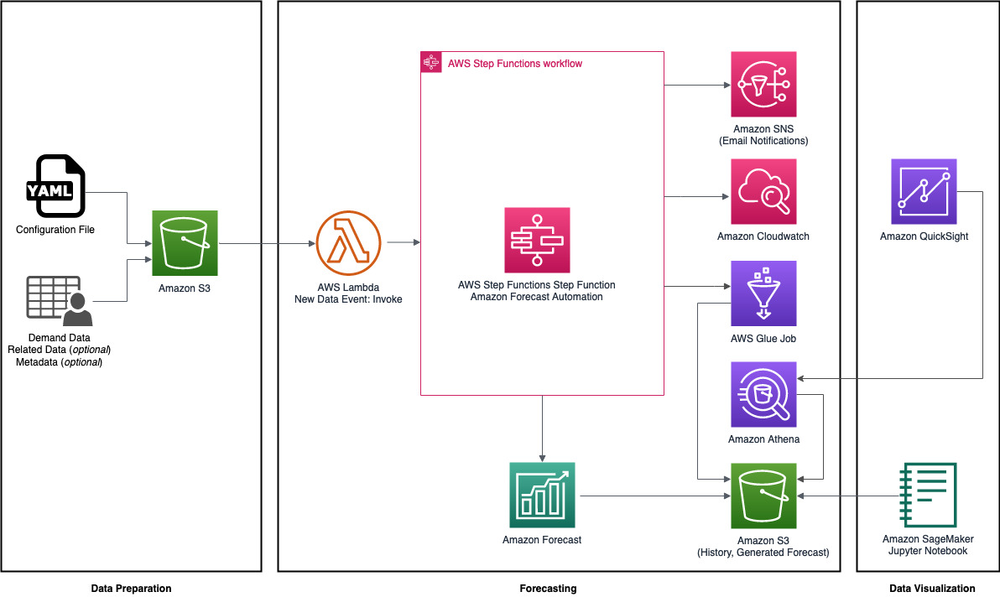

# Improving Forecast Accuracy with Machine Learning

The Improving Forecast Accuracy with Machine Learning solution is designed to help organizations that rely on generating 
accurate forecasts and store historical demand time series data. Whether organizations are developing forecasts for the 
first time, or optimizing their current pipeline, this solution will reduce the overhead cost of generating forecasts 
from time series data, related time series data, and item metadata.

This solution supports multiple forecasts and per-forecast parameter configuration in order to reduce the repetitive 
task of generating multiple forecasts. The use of an AWS Step Function eliminates the undifferentiated heavy lifting of
creating Amazon Forecast datasets, dataset groups, predictors, and forecasts—allowing developers and data scientists to
focus on the accuracy of their forecasts. Amazon Forecast predictors and forecasts can be updated as item demand data, 
related timeseries data, and item metadata are refreshed, which allows for A/B testing against different sets of related
timeseries data and item metadata. 

As predictors are generated, their accuracy is tracked over time in Amazon CloudWatch, which allows users to track
forecast accuracy and identify drifts over multiple forecasts and parameter-tuning configurations. 

To better capture and alert users of data quality issues, a configurable alert function can also be deployed with Amazon
Simple Notification Service (Amazon SNS). This notifies the user on success and failure of the automated forecasting 
job, reducing the need for users to monitor their forecast workflow. 

This guide provides infrastructure and configuration information for planning and deploying the solution in the AWS 
Cloud.

## Architecture
The following describes the architecture of the solution:

The AWS CloudFormation template deploys the resources required to automate your Amazon Forecast usage and deployments.
Based on the capabilities of the solution, the architecture is divided into three parts: Data Preparation, Forecasting,
and Data Visualization. The template includes the following components:

- An Amazon Simple Storage Service (Amazon S3) bucket for Amazon Forecast configuration where you specify configuration
settings for your dataset groups, datasets, predictors and forecasts, as well as the datasets themselves.
- An Amazon S3 event notification that triggers when new datasets are uploaded to the related Amazon S3 bucket.
- An AWS Step Functions State Machine. This combines a series of AWS Lambda functions that build, train. and deploy your
Machine Learning (ML) models in Amazon Forecast.
- An Amazon Simple Notification Service (Amazon SNS) topic and email subscription that notify an administrator user with
the results of the AWS Step Function.
- An optional Amazon SageMaker Notebook Instance that data scientists and developers can use to prepare and process
data, and evaluate your Forecast output.

**Note**: From v1.2.0, all AWS CloudFormation template resources are created by the [AWS CDK](https://aws.amazon.com/cdk/) 
and [AWS Solutions Constructs](https://aws.amazon.com/solutions/constructs/). Stateful CloudFormation template resources 
maintain the same logical ID comparing to v1.2.0, making the solution upgradable in place.

### AWS CDK Constructs 
[AWS CDK Solutions Constructs](https://aws.amazon.com/solutions/constructs/) make it easier to consistently create
well-architected applications. All AWS Solutions Constructs are reviewed by AWS and use best practices established by 
the AWS Well-Architected Framework. This solution uses the following AWS CDK Solutions Constructs: 

- [aws-lambda-sns](https://docs.aws.amazon.com/solutions/latest/constructs/aws-lambda-sns.html)

## Getting Started

You can launch this solution with one click from [AWS Solutions Implementations](https://aws.amazon.com/solutions/implementations/improving-forecast-accuracy-with-machine-learning/). 

To customize the solution, or to contribute to the solution, follow the steps below:

## Prerequisites
The following procedures assumes that all of the OS-level configuration has been completed. They are:

* [AWS Command Line Interface](https://aws.amazon.com/cli/)
* Python 3.7 or later

## 1. Build the solution

Clone this git repository

`git clone https://github.com/awslabs/<repository_name>`

## 2. Build the solution for deployment

Follow the steps in `source/infrastructure/README.md` ([here](source/infrastructure/README.md)) to use CDK to deploy the
solution

## 3. Test/ Demo the Solution

To test the solution, or provide a demo - you can follow the synthetic data generation instructions in
`source/synthetic/README.md` ([here](source/synthetic/README.md)).

### Known issues

***

Copyright 2018-2020 Amazon.com, Inc. or its affiliates. All Rights Reserved.

Licensed under the Apache License, Version 2.0 (the "License");
you may not use this file except in compliance with the License.
You may obtain a copy of the License at

    http://www.apache.org/licenses/LICENSE-2.0

Unless required by applicable law or agreed to in writing, software
distributed under the License is distributed on an "AS IS" BASIS,
WITHOUT WARRANTIES OR CONDITIONS OF ANY KIND, either express or implied.
See the License for the specific language governing permissions and
limitations under the License.